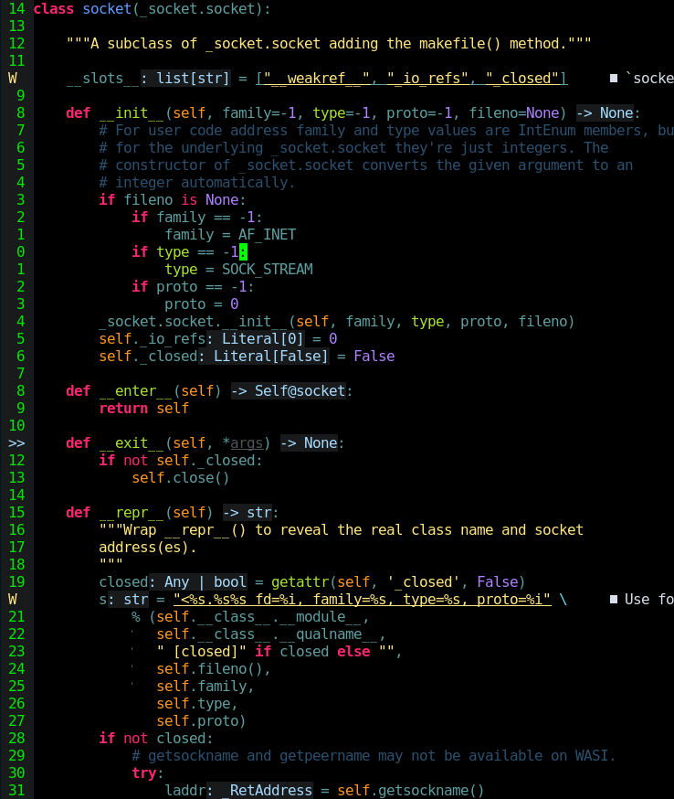
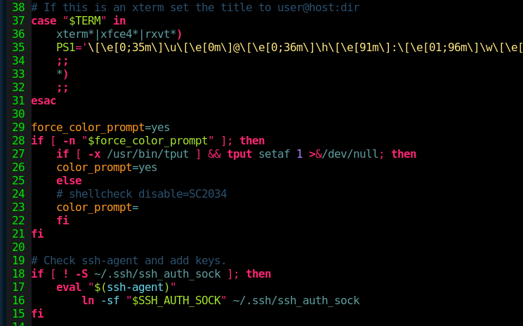
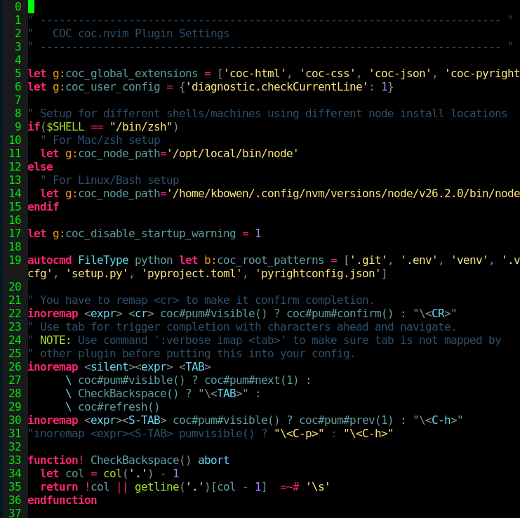
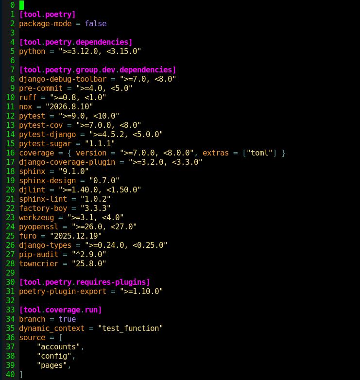
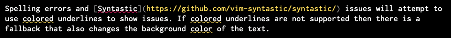
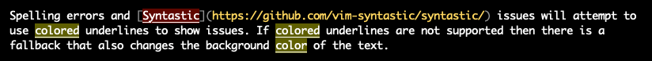

molokev - a dark theme for Vim
==============================

Molokev is re-worked version of the [Molokai-dark theme by @pR0Ps](https://github.com/pR0Ps/molokai-dark).

It uses a completely black background to increase the contrast between background and text.

256-color terminals are fully supported with only minor differences from the full-color version.


Screenshots
-----------

### Python


### Bash


### vimrc


### toml


### Spelling/Syntastic (with underline support)


### Spelling/Syntastic (no underline support)



Setup
-----
Install this colorscheme via your preferred Vim plugin installation method and configure it in your `~/.vimrc`:
```vim
colorscheme molokev
```

Options
-------
Spelling errors and [Syntastic](https://github.com/vim-syntastic/syntastic/) issues will attempt to
use colored underlines to show issues. If colored underlines are not supported then there is a
fallback that also changes the background color of the text.

The theme assumes that if you are running a gui like `gvim` it will support colored underlines but
if you're running `vim` in a terminal, it will not. These assumptions can be changed by setting the
following variables in your `~/.vimrc` (defaults shown):

```vim
let g:molokev_undercolor_gui = 1
let g:molokev_undercolor_cterm = 0

colorscheme molokev
```

License
-------
Licensed under the [Mozilla Public License, version 2.0](https://www.mozilla.org/en-US/MPL/2.0)
